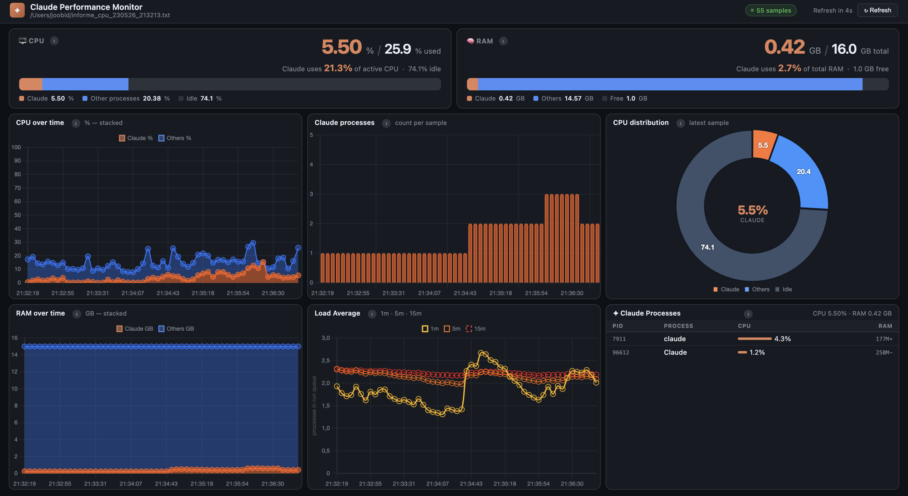

# Claude Performance Monitor

A lightweight local dashboard that tracks **CPU and RAM consumed by Claude** in real time,
comparing them against total system resources. Built with a Python HTTP server and a
single-page HTML dashboard — no external dependencies beyond Python 3.

---

## What it does

- Collects system metrics every N seconds using the macOS `top` process monitor
- Identifies **all processes whose name contains "claude"** and aggregates their CPU and RAM
- On every dashboard refresh, supplements `top` data with a live `ps ax` snapshot — the process table always reflects what is running at that instant
- Serves a live dashboard at `http://127.0.0.1:8765` that refreshes automatically
- Shows:
  - **Segmented resource bars** — Claude's share of total CPU and RAM at a glance
  - **Stacked time-series charts** — Claude vs rest-of-system over the full session
  - **CPU donut** — proportional breakdown of Claude / other / idle
  - **Process table** — every Claude subprocess with individual CPU and memory

---

## Architecture

```
start_monitor.sh  [samples] [interval_s]
  │
  ├─ sampler.py  → ~/informe_cpu_YYMMDD_HHMMSS.txt  (top-based log)
  │
  └─ server.py   → http://127.0.0.1:8765
       │
       ├─ GET /data   → JSON (parsed log + live ps snapshot for latest sample)
       └─ GET /       → monitor.html  (dashboard, polls /data every N s)
```

| File | Purpose |
|---|---|
| `start_monitor.sh` | Starts sampler + web server; kills any previous instance |
| `stop_monitor.sh` | Gracefully stops data collection and the web server |
| `sampler.py` | Runs `top -l 2 -s N` in a loop; discards the stale init sample; appends only the real delta block to the log |
| `server.py` | Parses the top log, aggregates Claude processes, augments the latest sample with a real-time `ps ax` snapshot, serves JSON + HTML |
| `monitor.html` | Self-contained dashboard (Chart.js via CDN) |
| `demo.sh` | **All-in-one**: starts monitor + stress test + opens browser |
| `start_stress_test.sh` | Launches N parallel local workers named `claude-worker-N` that burn CPU and allocate RAM — **no API calls, zero tokens** |
| `stop_stress_test.sh` | Stops all stress workers |
| `.claude-stress-launcher` | zsh helper: renames python3 to `claude-worker-N` via `exec -a` so the process is visible in top/ps |
| `.claude-stress.py` | Python worker: allocates RAM via numpy matrices and burns CPU with matrix multiplication |

---

## Quick start

### Requirements

- macOS 11 or later (Intel or Apple Silicon)
- Python 3 (pre-installed on macOS 12+; otherwise `brew install python`)

### Start the monitor

```bash
git clone https://github.com/joobid/claude-perfmon.git
cd claude-perfmon
chmod +x *.sh .claude-stress-launcher

./start_monitor.sh          # 360 samples × 60 s = 6 h (default)
```

The browser opens automatically at `http://127.0.0.1:8765`.
The first data point appears after the first interval (60 s by default).

**Customise the sampling interval:**

```bash
./start_monitor.sh              # 360 × 60 s = 6 h  (default)
./start_monitor.sh 720 30       # 720 × 30 s = 6 h, finer resolution
./start_monitor.sh 720 5        # 720 ×  5 s = 1 h, stress-test mode
./start_monitor.sh 20 10        # 20  × 10 s ≈ 3 min, quick test
```

### Stop

```bash
./stop_monitor.sh
```

---

## Dashboard panels



The dashboard is divided into three rows:

**Top row — live gauges**

- **CPU gauge** (left): Claude's share of active CPU % vs the total, shown as a segmented bar (Claude · Others · Idle) with exact figures below.
- **RAM gauge** (right): Claude's RAM in GB vs total installed, shown as a segmented bar (Claude · Others · Free).

**Middle row — time-series and breakdown**

- **CPU over time** (left): Stacked area chart — Claude CPU in orange, all other processes in blue. Lets you spot spikes and correlate them with activity.
- **Claude processes** (centre): Bar chart counting how many `claude-*` subprocesses were alive per sample. Useful for stress tests with multiple workers.
- **CPU distribution** (right): Donut chart for the latest sample — proportional breakdown of Claude / other / idle.

**Bottom row — memory, load, and live process list**

- **RAM over time** (left): Stacked area — Claude RAM in orange, other processes in blue. Tracks memory allocation over the session.
- **Load Average** (centre): System load over 1 min / 5 min / 15 min. A value of 1.0 means one CPU core is fully busy; values above your core count indicate queueing.
- **Claude Processes** (right): Live table — every `claude-*` subprocess at this instant, with PID, name, CPU %, and RAM. Refreshed from `ps ax` on every poll, so it captures short-lived processes that `top` might miss.

**Quick reference table**

| Panel | What it shows |
|---|---|
| **CPU gauge** | Claude's CPU % vs total active CPU, segmented bar (Claude · Others · Idle) |
| **RAM gauge** | Claude's RAM in GB vs total, segmented bar (Claude · Others · Free) |
| **CPU chart** | Stacked area over time — Claude (orange) + other processes (blue) |
| **RAM chart** | Stacked area over time — Claude (orange) + other processes (blue) |
| **Process count** | Bar chart of active Claude subprocesses per sample |
| **Load average** | System load 1 m / 5 m / 15 m (processes in run queue) |
| **CPU donut** | Proportional breakdown for the latest sample |
| **Process table** | All Claude subprocesses — PID, name, CPU %, RAM (live, from `ps`) |

---

## Stress test — verify the monitor without spending tokens

The stress test launches **N local Python processes** that appear as `claude-worker-1`,
`claude-worker-2`, … in `top` and `ps`. Because the name contains `"claude"`, the
monitor detects and tracks them as Claude processes.

**No Claude API calls are made. Zero tokens are consumed.**
The load is generated entirely on your machine via numpy matrix multiplication.

### How it works

Each worker:
1. **Allocates RAM** — creates two square float32 matrices totalling ~`RAM_MB` MB. They stay in memory for the duration of the run.
2. **Burns CPU** — runs `np.dot(A, B)` in a tight loop using Apple's Accelerate framework (BLAS), which saturates all available CPU cores.
3. **Appears as `claude-worker-N`** — the worker is launched through `.claude-stress-launcher`, a zsh script that uses `exec -a "claude-worker-N" python3 ...` to replace the process name at the OS level. `top`, `ps`, and the monitor all see `claude-worker-N`.

If `numpy` is not installed, the worker falls back to pure Python float arithmetic (lower CPU load, but same process naming and RAM allocation behaviour).

### Option A — All in one (recommended for a quick demo)

```bash
./demo.sh                    # 4 workers, 3 rounds × 45 s, 5 s sampling
./demo.sh 6 5 60 512         # 6 workers, 5 rounds × 60 s, 512 MB each
```

`demo.sh` starts the monitor at 5 s sampling, starts the workers, and opens the browser.

### Option B — Step by step

```bash
# Step 1 — start the monitor with a short interval
./start_monitor.sh 720 5

# Step 2 — in a second terminal, launch the stress test
./start_stress_test.sh                      # 4 workers, 3 × 45 s, 400 MB each
./start_stress_test.sh 6 5 60 512           # 6 workers, 5 × 60 s, 512 MB each
./start_stress_test.sh 8 0 0 600            # 8 workers, run until stopped
```

> If the monitor is not already running, `start_stress_test.sh` starts it
> automatically with the configured interval.

### Stress test parameters

```
./start_stress_test.sh [workers] [rounds] [duration_s] [ram_mb] [interval]

  workers     Parallel worker processes           (default: 4)
  rounds      Computation rounds per worker       (default: 3)
              0 = run indefinitely until stopped
  duration_s  Seconds of CPU/RAM load per round   (default: 45)
  ram_mb      RAM to allocate per worker, in MB   (default: 400)
  interval    Monitor sampling interval, seconds  (default: 5)
```

### What you will see in the dashboard

- Multiple rows in the **Claude Processes** table — one per `claude-worker-N`
- Spikes in the **CPU over time** chart — each worker pushes the system CPU up
- Rising values in the **RAM over time** chart — each worker holds `ram_mb` MB
- Higher bars in the **Claude processes count** panel

### Install numpy for maximum CPU load

```bash
pip3 install numpy --break-system-packages
```

Without numpy, the workers still run and appear in the dashboard, but CPU load is lower.

### Stop the stress test

```bash
./stop_stress_test.sh     # stops all claude-worker-N processes
./stop_monitor.sh         # stops data collection and the web server
```

---

## Why the process table is always real time

`top` samples at intervals (every 5 s in stress-test mode). A process that starts and
exits between two samples can be missed entirely.

`server.py` addresses this by running `ps ax` on every `/data` request and replacing
the process list in the **latest** sample with the live result. Historical samples
remain as recorded by `top`. The process table in the dashboard therefore reflects
what is running at the moment you look at it, not what `top` captured N seconds ago.

---

## How `top` sampling works

`start_monitor.sh` delegates to `sampler.py`, which runs `top -l 2 -s N` repeatedly:

- `-l 2` produces two blocks: the first is a stale "init" measurement; the second is
  the real delta computed over the interval. `sampler.py` discards the first and writes
  only the second.
- This avoids the drift problems that affect a single long `top -l <N>` session under
  `nohup`.
- Each block is appended to `~/informe_cpu_YYMMDD_HHMMSS.txt`.

`server.py` splits the file on `Processes:` headers, parses each block, and
aggregates metrics for any process whose name contains `"claude"` (case-insensitive).
Total RAM is read from `sysctl hw.memsize` at startup so it is always accurate.

---

## Configuration reference

| Parameter | Default | Description |
|---|---|---|
| `samples` | `360` | Number of top samples to collect (`start_monitor.sh` arg 1) |
| `interval_seconds` | `60` | Seconds between samples (`start_monitor.sh` arg 2) |
| `workers` | `4` | Parallel stress workers (`start_stress_test.sh` arg 1) |
| `rounds` | `3` | Rounds per worker, 0 = infinite (`start_stress_test.sh` arg 2) |
| `duration_s` | `45` | Seconds of load per round (`start_stress_test.sh` arg 3) |
| `ram_mb` | `400` | MB allocated per worker (`start_stress_test.sh` arg 4) |
| `PORT` | `8765` | HTTP port for the dashboard (edit in `server.py`) |
| `CLAUDE_KEYWORDS` | `['claude']` | Process name filters (edit in `server.py`) |

**Sampling interval quick reference:**

| Use case | Command | Coverage |
|---|---|---|
| Normal monitoring (default) | `./start_monitor.sh` | 360 × 60 s = 6 h |
| Fine-grained monitoring | `./start_monitor.sh 720 30` | 720 × 30 s = 6 h |
| Stress-test mode | `./start_monitor.sh 720 5` | 720 × 5 s = 1 h |
| Custom | `./start_monitor.sh <N> <S>` | N × S seconds total |

To also track other processes (e.g. `node` or `python`), edit `server.py`:

```python
CLAUDE_KEYWORDS = ['claude', 'node', 'python']
```

---

## Troubleshooting

**No connection / dashboard won't load**
Open `http://127.0.0.1:8765` in a browser. Do not open `monitor.html` directly as a
file — browsers block local `fetch()` calls from `file://` URLs.

**RAM shows `—` or "Others" shows 0 GB**
Check that `server.py` can read the `PhysMem:` line from the log:
```bash
grep 'PhysMem' ~/informe_cpu_*.txt | tail -3
```
If it prints nothing, your macOS version may use a different field name — open an issue.

**Port already in use**
```bash
lsof -ti tcp:8765 | xargs kill -9
./start_monitor.sh
```

**No Claude processes detected**
The filter matches process names containing `"claude"` (case-insensitive). Verify with:
```bash
ps aux | grep -i claude
```

**Stress test workers not appearing in the dashboard**
Use a short sampling interval (≤ 10 s) and check that numpy is installed:
```bash
./stop_monitor.sh && ./start_monitor.sh 720 5
pip3 install numpy --break-system-packages
./start_stress_test.sh
```

**`.claude-stress-launcher` permission denied**
```bash
chmod +x .claude-stress-launcher .claude-stress.py
```

**Low CPU load during stress test**
Without numpy, workers use pure Python and generate less CPU pressure. Install numpy:
```bash
pip3 install numpy --break-system-packages
```

---

## Linux

### Requirements

- Python 3
- `top` (included in `procps` on Debian/Ubuntu, `procps-ng` on Fedora/RHEL)

### Differences from macOS

Linux `top` uses **batch mode** (`-b`) instead of `-l`, and the output format differs.
You need a Linux-specific start script and a small adjustment to `server.py`.

### Start script for Linux

Create `start_monitor_linux.sh`:

```bash
#!/bin/bash
SAMPLES="${1:-360}"
INTERVAL="${2:-60}"
TIMESTAMP=$(date +%d%m%y_%H%M%S)
LOG_FILE="$HOME/informe_cpu_${TIMESTAMP}.txt"
SCRIPT_DIR="$(cd "$(dirname "${BASH_SOURCE[0]}")" && pwd)"

nohup top -b -n "$SAMPLES" -d "$INTERVAL" > "$LOG_FILE" 2>/dev/null &
echo "$LOG_FILE" > "$SCRIPT_DIR/.current_log"
echo "$INTERVAL"  > "$SCRIPT_DIR/.current_interval"
nohup python3 "$SCRIPT_DIR/server.py" "$LOG_FILE" 8765 > "$SCRIPT_DIR/.server.log" 2>&1 &
sleep 2
echo "Dashboard → http://127.0.0.1:8765"
xdg-open "http://127.0.0.1:8765" 2>/dev/null || true
```

### Parser adjustments for Linux

Linux `top -b` sample blocks look like:

```
top - 10:30:00 up 2 days, load average: 1.23, 1.45, 1.67
Tasks: 543 total,   3 running, 540 sleeping
%Cpu(s): 12.5 us,  8.3 sy,  0.0 ni, 79.1 id
MiB Mem :  15826.5 total,   1898.2 free,  12025.8 used

  PID USER   PR  NI    VIRT    RES  %CPU  %MEM  COMMAND
 1234 user   20   0 1234567 456789  12.5   2.8  Claude
```

Key regex differences needed in `server.py`:

```python
# Timestamp
re.search(r'top - (\d{2}:\d{2}:\d{2})', block)
# CPU (idle is the 4th field)
re.search(r'%Cpu.*?(\d+\.\d+)\s+us.*?(\d+\.\d+)\s+sy.*?(\d+\.\d+)\s+id', block)
# Memory (MiB)
re.search(r'MiB Mem\s*:\s*([\d.]+)\s+total,\s*([\d.]+)\s+free,\s*([\d.]+)\s+used', block)
# Process column order: PID(0) USER(1) PR(2) NI(3) VIRT(4) RES(5) %CPU(8) COMMAND(11)
```

---

## License

MIT
